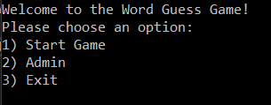
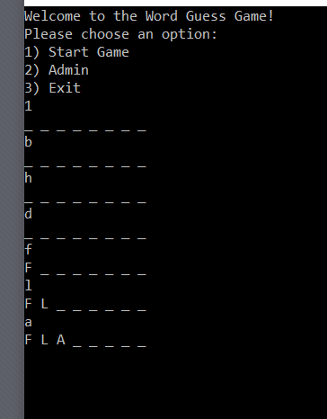
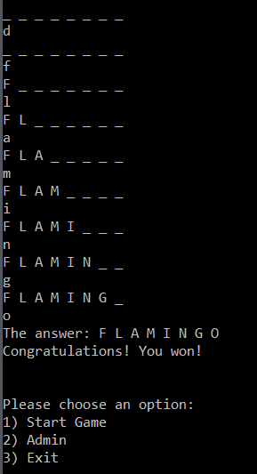
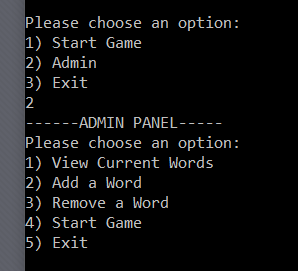
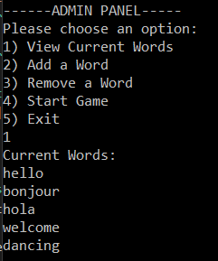
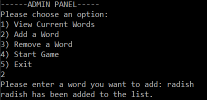
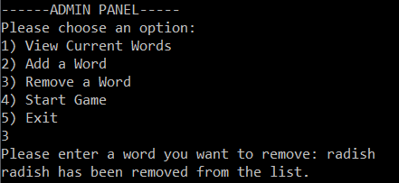

# Console Word Guess Game (Hangman)

Lab03-System-IO

*Author: Chris Cummings*

----

## Description
This is a console application that mimics the game 'hangman'.  The game is a word guess game where
you guess single letters in order to reveal the whole word.  The words are populated from a text file.
The game also has an admin menu that lets you view, add or remove current words.

---

### Getting Started
Clone this repository to your local machine.

```
$ git clone https://github.com/cdcummings10/Lab03--WordGuessGame.git
```

### To run the program from Visual Studio:
Select ```File``` -> ```Open``` -> ```Project/Solution```

Next navigate to the location you cloned the Repository.

Double click on the ```Lab03--WordGuessGame``` directory.

Then select and open ```WordGuessGame.sln```

Click on ```Start```

### To run the executable:

Navigate to folder ```Lab03--WordGuessGame``` directory.

Navigate through these folders: ```WordGuessGame``` => ```WordGuessGame``` => ```bin``` => ```Debug```

Run ```WordGuessGame.exe```

---

### Visuals

#### Application Start

#### Playing the Game

#### Game is Won

#### Admin Panel

#### View Words

#### Add a Word

#### Remove a Word


---

### Time Estimates
Estimated time to finish: 8 Hours

Actual time to finish: 4 Hours

### Change Log 

1.0: *Finished Guessing Game. Added all functionality to app.* - 18 Oct 2019
1.1: *Updated characters guessed storage so no letter can be guessed twice.* - 21 Oct 2019
